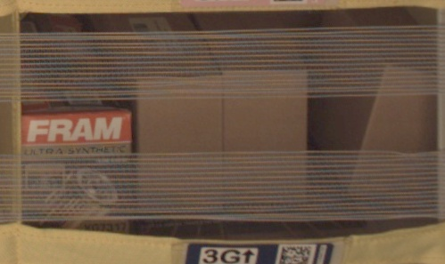
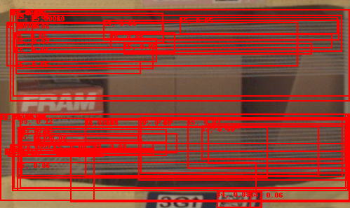
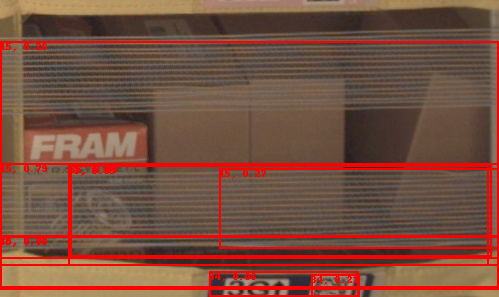

&lt;script async src="https://cdnjs.cloudflare.com/ajax/libs/mathjax/2.7.0/MathJax.js?config=TeX-AMS_CHTML"&gt;&lt;/script&gt;

# Project Proposal: Inventory Monitoring at Distribution Centers

## Domain Background:

Distribution centers play a crucial role in supply chain management, serving as hubs where goods are stored, sorted, and distributed to their final destinations. Efficient inventory management is essential for the smooth functioning of distribution centers, ensuring that the right products are available in the right quantities at the right time.

Traditional methods of inventory monitoring often rely on manual counting or barcode scanning, which can be time-consuming and error-prone. In recent years, advances in technology, particularly in the field of computer vision and machine learning, have opened up new possibilities for automating inventory monitoring processes.

## Problem Statement:

The problem addressed in this project is the accurate counting of objects within bins at distribution centers using computer vision techniques. The goal is to develop a model that can analyze images of bins containing objects and accurately determine the number of objects present in each bin. This automated counting system will streamline inventory monitoring processes, reduce manual effort, and improve overall efficiency.

## Solution Statement:

The proposed solution involves the development of a machine learning model trained on the Amazon Bin Image Dataset. This model will utilize convolutional neural networks (CNNs) to analyze images of bins and classify the number of objects present. By leveraging AWS SageMaker, the model will be trained using good machine learning engineering practices, ensuring scalability, reliability, and reproducibility.

Another possible solution was to use a pre-trained [object detection model or instance segmentation model](https://pytorch.org/vision/stable/models.html#object-detection-instance-segmentation-and-person-keypoint-detection). However, it was rejected after a small-scale trial showed that it did not work as follows. It is difficult to apply the pre-trained model as is, and fine tuning is not possible due to the characteristics of this data set.

- Bin image with 4 quantity as input
    
    

- Pre-trained Object Detection (RetinaNet)
    
    

- Pre-trained Instance Segmentation (Mask R-CNN)
    
    

## Datasets and Inputs:

The project will utilize the [Amazon Bin Image Dataset](https://registry.opendata.aws/amazon-bin-imagery/), which contains 500,000 images of bins containing one or more objects. Each image is accompanied by metadata providing information such as the number of objects, dimensions, and types of objects present in the bin. This dataset will serve as the input for training the machine learning model, pairs of images and labels.

- ### (1) Image 
    

- ### (2) Metadata
    ```
    {
        "BIN_FCSKU_DATA": {
            "B000C33MI2": {
                "asin": "B000C33MI2",
                "height": {
                    "unit": "IN",
                    "value": 2.79921259557
                },
                "length": {
                    "unit": "IN",
                    "value": 3.90157479917
                },
                "name": "FRAM XG7317 ULTRA Spin-On Oil Filter with Sure Grip",
                "normalizedName": "FRAM XG7317 ULTRA Spin-On Oil Filter with Sure Grip",
                "quantity": 4,
                "weight": {
                    "unit": "pounds",
                    "value": 0.3000050461296
                },
                "width": {
                    "unit": "IN",
                    "value": 2.90157480019
                }
            },
            "B0050Z27KG": {
                "asin": "B0050Z27KG",
                "height": {
                    "unit": "IN",
                    "value": 0.899999999082
                },
                "length": {
                    "unit": "IN",
                    "value": 11.299999988474
                },
                "name": "Suncatcher - Axicon Rainbow Window - Includes Bonus \"Rainbow on Board\" Sun Catcher",
                "normalizedName": "Suncatcher - Axicon Rainbow Window - Includes Bonus \"Rainbow on Board\" Sun Catcher",
                "quantity": 2,
                "weight": {
                    "unit": "pounds",
                    "value": 0.5
                },
                "width": {
                    "unit": "IN",
                    "value": 7.699999992146
                }
            },
            "B01BV89HNU": {
                "asin": "B01BV89HNU",
                "height": {
                    "unit": "IN",
                    "value": 2.1999999977560005
                },
                "length": {
                    "unit": "IN",
                    "value": 3.99999999592
                },
                "name": "Type C, iOrange-E 2 Pack 6.6 Ft Braided Cable for Nexus 6P, Nexus 5X, Onplus 2, Lumia 950, LG G5, Apple Macbook 12 inch, ChromeBook Pixel, Nokia N1 Tablet and Other USB C Devices, Black",
                "normalizedName": "2 Pack Type C, iOrange-E 6.6 Ft Braided Cable for Nexus 6P, Nexus 5X, Onplus 2, Lumia 950, LG G5, Apple Macbook 12 inch, ChromeBook Pixel, Nokia N1 Tablet and Other USB C Devices, Black",
                "quantity": 6,
                "weight": {
                    "unit": "pounds",
                    "value": 0.3499999997064932
                },
                "width": {
                    "unit": "IN",
                    "value": 3.899999996022
                }
            }
        },
        "EXPECTED_QUANTITY": 12
    }
    ```

## Benchmark Model:

Pablo [1] applied Logistic Regression, Decision Tree, SVM and Convolutional Neural Networks via Transfer Learning on the Dataset. 

### Multi-class Classifier Accuracy [1]
| Object Quantity | Logistic Regression | Decision Tree | SVM |
|-----------------|---------------------|---------------|-----|
| 0               | 0.33                | 0.12          | 0.33|
| 1               | 0.19                | 0.14          | 0.12|
| 2               | 0.24                | 0.15          | 0.29|
| 3               | 0.25                | 0.28          | 0.26|
| 4               | 0.24                | 0.21          | 0.29|
| 5               | 0.20                | 0.21          | 0.24|
| Overall         | 0.24                | 0.19          | 0.26|

### Accuracy of CNN Models [1]
| Object Quantity | Training Accuracy | Val Accuracy | Val RMSE |
|-----------------|-------------------|--------------|----------|
| ResNet18 SGD    | 55.9              | 50.4         | 0.98     |
| ResNet34 SGD    | 55.2              | 51.2         | 0.99     |
| ResNet34 SGDR   | 57.8              | 53.8         | 0.94     |
| ResNet34 Adam   | 50.6              | 51.8         | 0.99     |
| ResNet34 Adam All| 62.3             | 56.2         | 0.90     |
| ResNet50 Adam All| 61.2             | 55.2         | 0.91     |

And their feature works [1] are following.

1. Manual cleaning of data to remove problematic images can enhance learning.
2. The Adam optimizer shows improved performance with larger datasets.
3. Exploring the possibility of capturing photos from different angles and utilizing metadata to track the content of a bin over time.
4. Due to the large number of product skews, images may not adhere to the assumption of being drawn from a single distribution, suggesting the use of ensemble models with varied architectures and learning approaches for higher accuracy.


## Evaluation Metrics:

The performance of the machine learning model will be evaluated using metrics such as accuracy, precision, recall, and F1-score. Accuracy measures the proportion of correctly classified bins, while precision measures the proportion of true positive predictions among all positive predictions. Recall measures the proportion of true positive predictions among all actual positive instances. The F1-score provides a balance between precision and recall, offering a comprehensive assessment of the model's performance. In this project, we choose Accuracy in order to align the metrics with the study [1]. The definition formula is as follows.

$$
\text{Accuracy} = \frac{\text{Number of correctly classified samples}}{\text{Total number of samples}}
$$

## Project Design:

The project will follow a systematic workflow, including data preprocessing, model development, training, and evaluation. AWS SageMaker will be used to (1) upload the training data to an S3 bucket, (2) write a training script, and (3) train the machine learning model. The training script will be developed to handle the classification task, utilizing a chosen model architecture such as a pre-trained CNN or a custom-designed neural network. The trained model will then be evaluated using the provided evaluation metrics, and any necessary refinements or optimizations will be made iteratively.

Since the study [1] have shown that Accuracy improves as the number of layers of the Resnet is increased, in this project, transfer learning will be performed using 152 layers of maximum the [Pytorch Resnet](https://pytorch.org/hub/pytorch_vision_resnet/) with the Adam Optimizer.

## References:
[1] Rodriguez Bertorello, Pablo Martin and Sripada, Sravan and Dendumrongsup, Nutchapol, Amazon Inventory Reconciliation Using AI (December 15, 2018). Available at SSRN: https://ssrn.com/abstract=3311007 or http://dx.doi.org/10.2139/ssrn.3311007