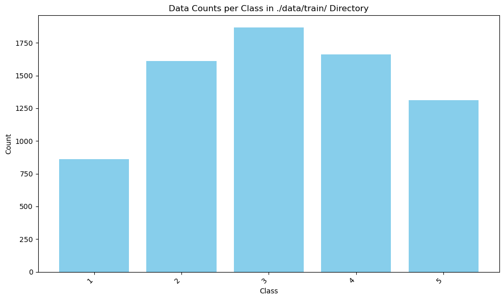
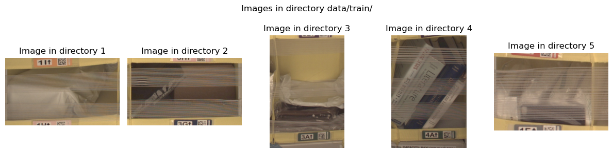
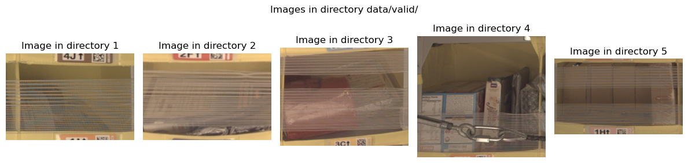
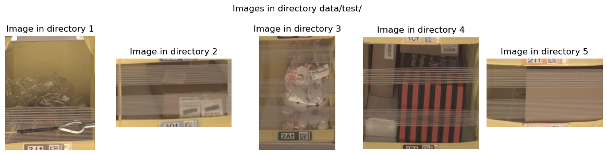
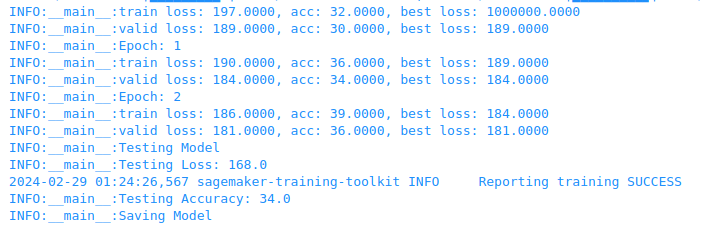

# Inventory Monitoring at Distribution Centers

In this project, we aim to develop a machine learning model for inventory monitoring at distribution centers using image data of bins containing objects. The objective is to accurately classify the number of objects in each bin, which can aid in inventory tracking and ensuring the correctness of delivery consignments.
A Metric used to measure the performance of a model is Accuracy. The definition formula is as follows.

$$
\text{Accuracy} = \frac{\text{Number of correctly classified samples}}{\text{Total number of samples}}
$$

## Project Set Up and Installation
This project used AWS Sagemaker and S3; attach the AmazonS3FullAccess policy to the SageMaker execution role so that Sagemaker can access buckets on S3.

## Dataset

### Overview
The dataset used in this project is the [Amazon Bin Image Dataset](https://registry.opendata.aws/amazon-bin-imagery/), which comprises 500,000 images of bins containing one or more objects. Each image is accompanied by metadata containing information such as the number of objects, dimensions, and object types.

### Access
The data is accessed through an S3 bucket on AWS. 

- How to Download
  
  This allows the dataset to be stored in `. /data/train`, `. /data/valid`, `. /data/test` directory.
  ```
  def download_and_arrange_data():
    s3_client = boto3.client('s3')

    with open('file_list.json', 'r') as f:
        d = json.load(f)

    for k, v in d.items():
        print(f"Downloading Images with {k} objects")
        train_data, test_data = train_test_split(v, test_size=0.3, random_state=42)
        valid_data, test_data = train_test_split(test_data, test_size=0.33, random_state=42)

        for data, folder in zip([train_data, valid_data, test_data], ['train', 'valid', 'test']):
            directory = os.path.join('data', folder, k)
            if not os.path.exists(directory):
                os.makedirs(directory)
            for file_path in tqdm(data):
                file_name = os.path.basename(file_path).split('.')[0] + '.jpg'
                s3_client.download_file('aft-vbi-pds', os.path.join('bin-images', file_name),
                                        os.path.join(directory, file_name))
  ```
  Folders are created and downloaded for each ground truth of containing objects as follows. The downloaded data is managed by [file_list.json](./file_list.json).
  ```
  - data
    - train
        - 1
            - *.jpg
        - 2
            - *.jpg
        - 3
            - *.jpg
        - 4
            - *.jpg
        - 5
            - *.jpg
    - valid
        - 1
            - *.jpg
        - 2
            - *.jpg
        - 3
            - *.jpg
        - 4
            - *.jpg
        - 5
            - *.jpg
    - test
        - 1
            - *.jpg
        - 2
            - *.jpg
        - 3
            - *.jpg
        - 4
            - *.jpg
        - 5
            - *.jpg
    ```
    
- How to Upload

  This allows the dataset to be uploaded in private S3 bucket. 
  ```
  sagemaker_session.upload_data(path="./data", bucket=bucket, key_prefix=prefix)
  ```

### Explanatory Data Analysis

This time, the dataset was divided into train, valid, and test, and the proportions were set to 0.7, 0.2, and 0.1, respectively. The data distribution for each is shown below, it was found that the dataset was unbalanced.




The image samples are as follows. It was found that the image sizes were not standardized and that objects were sometimes shielded by the film.







## Model Training
We chose to use a pre-trained CNN, Resnet152, for transfor learning. This model is highly expressive with the maximum number of layers of Resnet available in [Pytorch](https://pytorch.org/hub/pytorch_vision_resnet/). [The study](https://papers.ssrn.com/sol3/papers.cfm?abstract_id=3311007) have also shown that accuracy tends to be higher as the number of layers increases, so this model with the maximum number of layers was selected.
The Fully Connected layer was defined as follows
```
nn.Sequential(nn.Linear(model.fc.in_features, 128), nn.ReLU(inplace=True), nn.Linear(128, 5))
```
Resnet's input is 224x224, so the following resizing was performed as preprocessing.
```
transforms.Compose([
        transforms.Resize((224, 224)),
        transforms.ToTensor(),
        ])
```
Hyperparameters are listed below and are based on [the study](https://papers.ssrn.com/sol3/papers.cfm?abstract_id=3311007).
```
{'batch_size': 128, 'epochs': 3, 'learning_rate': 0.001}
```
CrossEntropyLoss was selected as the criterion and Adam as the optimizer, referring to [the study](https://papers.ssrn.com/sol3/papers.cfm?abstract_id=3311007).
```
criterion = nn.CrossEntropyLoss()
optimizer = optim.Adam(model.fc.parameters(), lr=args.learning_rate)
```

The test Accuracy after training was `34.0`.



Comparisons with previous studies are as follows. The model used in this study was not as accurate as expected. It is possible that the learning process was not as advanced as it could have been because this study used a subset of about 10,000 images rather than the full data set of 500,000 images.

### Accuracy of CNN Models
| Object Quantity | Training Accuracy | Val Accuracy |
|-----------------|-------------------|--------------|
| ResNet18 SGD    | 55.9              | 50.4         |
| ResNet34 SGD    | 55.2              | 51.2         |
| ResNet34 SGDR   | 57.8              | 53.8         |
| ResNet34 Adam   | 50.6              | 51.8         |
| ResNet34 Adam   | 62.3              | 56.2         |
| ResNet50 Adam   | 61.2              | 55.2         |
|                 |                   |              |
| __ResNet152 Adam (my model)__   | 39.0 | 36.0      |


## Machine Learning Pipeline
The project pipeline involves the following steps:

- Data Preparation: Preprocessing the images and metadata, including resizing images, encoding metadata, and splitting the dataset into training, validation, and testing sets.
- Model Development: Defining the CNN architecture, loading pre-trained weights (if applicable), and fine-tuning the model on the training data.
- Model Training: Training the model using SageMaker, specifying hyperparameters and monitoring the training process.
- Model Evaluation: Evaluating the trained model's performance on the validation set and tuning hyperparameters if necessary.
- Model Deployment (Optional): Deploying the trained model to an endpoint for real-time inference.

