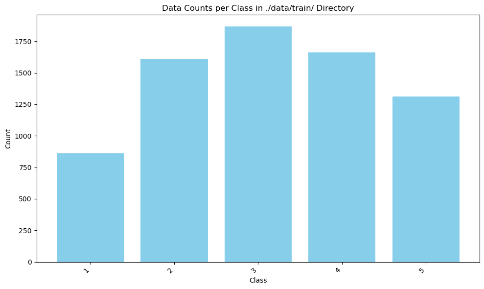
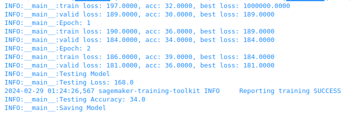

# Project : Inventory Monitoring at Distribution Centers

# Definition

## Project Overview
Distribution centers often use robots to move objects as a part of their operations. Objects are carried in bins which can contain multiple objects. In this project, you will have to build a model that can count the number of objects in each bin. A system like this can be used to track inventory and make sure that delivery consignments have the correct number of items.

To build this project you will use AWS SageMaker and good machine learning engineering practices to fetch data from a database, preprocess it, and then train a machine learning model. This project will serve as a demonstration of end-to-end machine learning engineering skills that you have learned as a part of this nanodegree.

## Problem Statement
The problem addressed in this project is the accurate counting of objects within bins at distribution centers using computer vision techniques. The goal is to develop a model that can analyze images of bins containing objects and accurately determine the number of objects present in each bin. This automated counting system will streamline inventory monitoring processes, reduce manual effort, and improve overall efficiency.

## Metrics
In this project, we aim to develop a machine learning model for inventory monitoring at distribution centers using image data of bins containing objects. The objective is to accurately classify the number of objects in each bin, which can aid in inventory tracking and ensuring the correctness of delivery consignments. A Metric used to measure the performance of a model is Accuracy. The definition formula is as follows.

$$
\text{Accuracy} = \frac{\text{Number of correctly classified samples}}{\text{Total number of samples}}
$$

# Analysis

## Data Exploration & Exploratory Visualization
This time, the dataset was divided into train, valid, and test, and the proportions were set to 0.7, 0.2, and 0.1, respectively. The data distribution for each is shown below, it was found that the dataset was unbalanced.




The image samples are as follows. It was found that the image sizes were not standardized and that objects were sometimes shielded by the film.


## Algorithms and Techniques
We chose to use a pre-trained CNN, `Resnet152`, for transfor learning. This model is highly expressive with the maximum number of layers of Resnet available in [Pytorch](https://pytorch.org/hub/pytorch_vision_resnet/). [The study](https://papers.ssrn.com/sol3/papers.cfm?abstract_id=3311007) have also shown that accuracy tends to be higher as the number of layers increases, so this model with the maximum number of layers was selected.

## Benchmark

Pablo [1] applied Logistic Regression, Decision Tree, SVM and Convolutional Neural Networks via Transfer Learning on the Dataset. 

- Accuracy of CNN Models [1]
  
    | Object Quantity | Training Accuracy | Val Accuracy |
    |-----------------|-------------------|--------------|
    | ResNet18 SGD    | 55.9              | 50.4         |
    | ResNet34 SGD    | 55.2              | 51.2         |
    | ResNet34 SGDR   | 57.8              | 53.8         |
    | ResNet34 Adam   | 50.6              | 51.8         |
    | ResNet34 Adam   | 62.3              | 56.2         |
    | ResNet50 Adam   | 61.2              | 55.2         |

# Methodology

## Data Preprocessing
Resnet's input is 224x224, so the following resizing was performed as preprocessing.
```
transforms.Compose([
        transforms.Resize((224, 224)),
        transforms.ToTensor(),
        ])
```

## Implementation
The Fully Connected layer was defined as follows
```
nn.Sequential(nn.Linear(model.fc.in_features, 128), nn.ReLU(inplace=True), nn.Linear(128, 5))
```
Hyperparameters are listed below and are based on [the study](https://papers.ssrn.com/sol3/papers.cfm?abstract_id=3311007).
```
{'batch_size': 128, 'epochs': 3, 'learning_rate': 0.001}
```
CrossEntropyLoss was selected as the criterion and Adam as the optimizer, referring to [the study](https://papers.ssrn.com/sol3/papers.cfm?abstract_id=3311007).
```
criterion = nn.CrossEntropyLoss()
optimizer = optim.Adam(model.fc.parameters(), lr=args.learning_rate)
```

## Refinement
The hyperparameters were adjusted. Despite these efforts, however, no significant improvement in accuracy was achieved.


# Results

## Model Evaluation and Validation
The test Accuracy after training was `34.0`.



## Justificatiion
Comparisons with [the study](https://papers.ssrn.com/sol3/papers.cfm?abstract_id=3311007) are as follows. Our model was not as accurate as expected. It is possible that the learning process was not as advanced as it could have been because this study used a subset of about 10,000 images rather than the full data set of 500,000 images.

### Accuracy of CNN Models
| Object Quantity | Training Accuracy | Val Accuracy |
|-----------------|-------------------|--------------|
| ResNet18 SGD    | 55.9              | 50.4         |
| ResNet34 SGD    | 55.2              | 51.2         |
| ResNet34 SGDR   | 57.8              | 53.8         |
| ResNet34 Adam   | 50.6              | 51.8         |
| ResNet34 Adam   | 62.3              | 56.2         |
| ResNet50 Adam   | 61.2              | 55.2         |
|                 |                   |              |
| __ResNet152 Adam (my model)__   | 39.0 | 36.0      |

# Conclusion
In conclusion, while the developed model utilizing ResNet152 showed some promise, its performance fell short of expectations. Possible avenues for future improvement include acquiring and annotating a larger and more diverse dataset, exploring more sophisticated network architectures, and fine-tuning hyperparameters extensively. Additionally, incorporating advanced techniques such as object detection instead of image classification may lead to better results. Despite the current limitations, this project serves as a valuable foundation for further research and development in the field of inventory monitoring at distribution centers.

# References
[1] Rodriguez Bertorello, Pablo Martin and Sripada, Sravan and Dendumrongsup, Nutchapol, Amazon Inventory Reconciliation Using AI (December 15, 2018). Available at SSRN: https://ssrn.com/abstract=3311007 or http://dx.doi.org/10.2139/ssrn.3311007